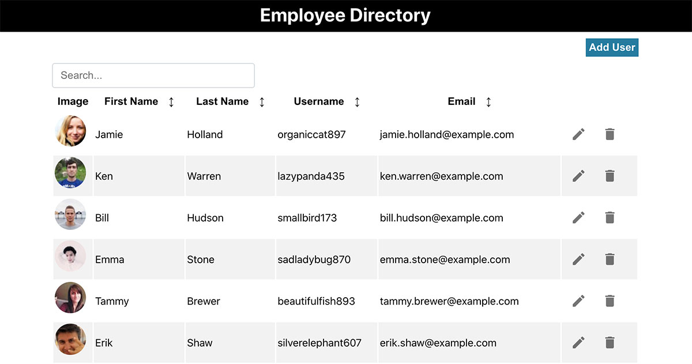

# Directory

## Overview

A React JS CRUD application that populates a table with data that can be sorted in ascending/descending order for various categories, as well as via a search input. Users can add, update, and delete items added to the directory.

## Technologies Used

- [React JS](https://reactjs.org/)
- [Node](https://nodejs.org/)
- [Express](https://expressjs.com/)
- [Randomuser.me](https://randomuser.me/) for populating the table with random user data
- [Axios](https://github.com/axios/axios) for fetching API data
- [Material UI](https://material-ui.com/) for icons and UI elements
- [Jest](https://jestjs.io/) for testing
- [Prettier](https://prettier.io/) for formatting the project's code

## Approach

I started off using `create-react-app` to build out the framework for the CRUD functionality, before implementing filters and more customization. I decided to use a table to display the directory data, since it was easier and more intuitive for users to have column sorting for different categories. I decided to focus on using React hooks instead of Redux for managing state.

After adding pagination, search filtering, column sorting, and modals for editing, I added tests once the basic structure was in placed and worked on improving the application's UI.

Next, I worked on setting up Node/Express for the backend for serving the API.

## Installation

To run locally:

- `git clone` this repo and `cd` into the `directory` folder
- `npm i` to install dependencies
- create a `.env` within the project's root directory
- `npm run dev` to run the frontend and backend locally

To run prettier on the project after making changes, use `npm run format`

## Next Steps

- Storing data to a database and image handling: since this isn't hooked up to a database or custom API (and is using mock data), users aren't able to upload images. Currently the application adds a default image whenever a user adds a new item.
- Properly setup post requests that connect passing data from the frontend to backend.
- More specific tests: the current tests check to make sure major components are rendering properly, but I would want to implement more specific tests for the application's functionality.
- Add a loader for when the data is being fetched.
- Instead of using modals for editing users, use inline editing.
- Add active classes for the pagination.
- Have a better design implemented and a different way to manage styles - perhaps with styled components; also add in UI-related animations for sorting and removing items.
- Right now the header only consists of the name of the application. For an application in production, I would add navigation and routing.
- Have a confirmation message when the user deletes an item from the table.